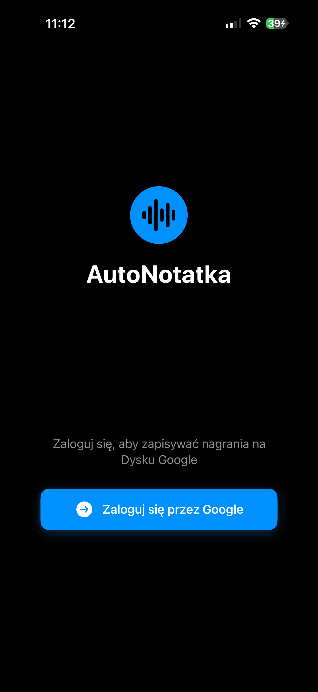
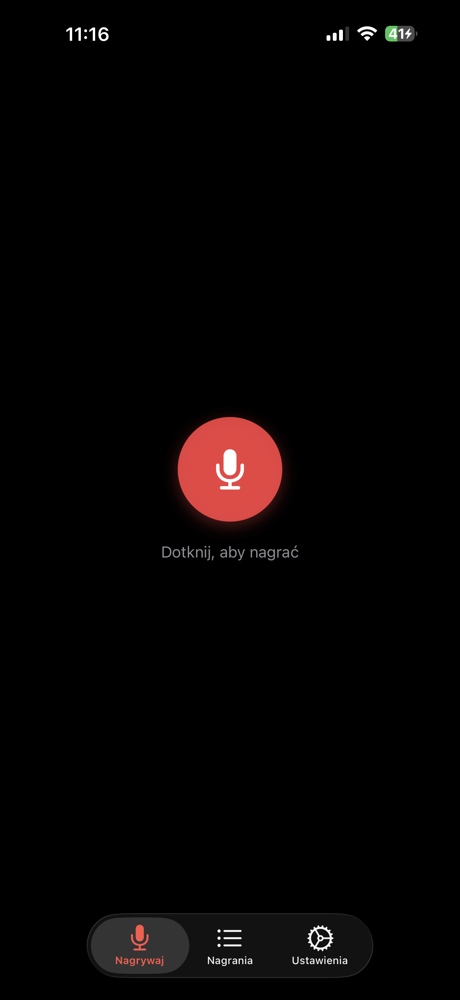
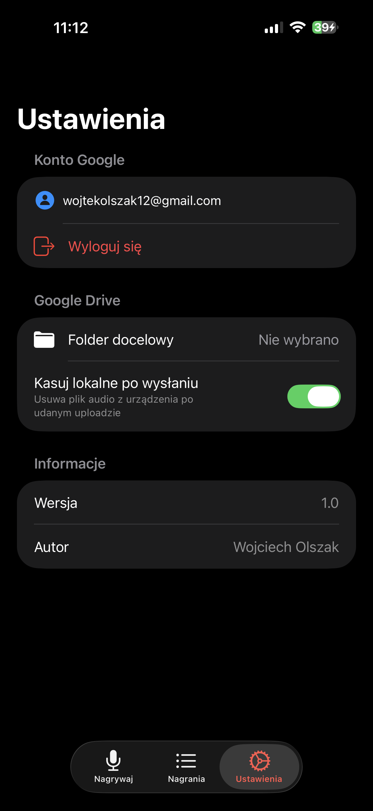
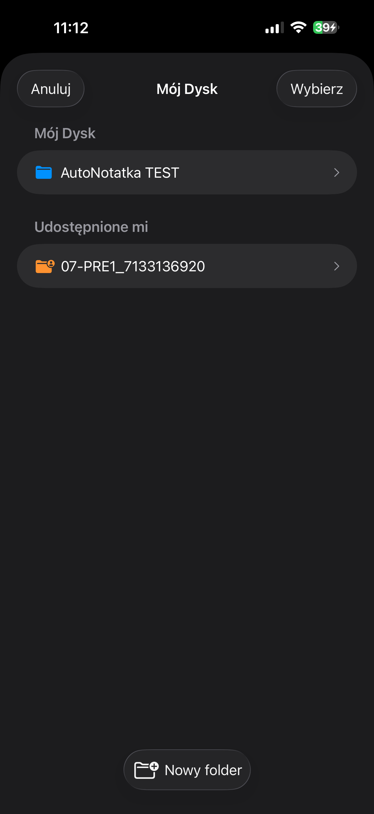

# auto-voice-notes


Professional Audio Cloud Recorder for iOS. Record high-quality .m4a audio and have it automatically uploaded to your selected Google Drive folder. Designed for professionals who need reliable, hands-free audio capture with seamless cloud backup — no manual file management required.

## Screenshots

<p align="center">
  &nbsp;&nbsp;
  &nbsp;&nbsp;
  &nbsp;&nbsp;
  &nbsp;&nbsp;
  
</p>

<p align="center">
  <sub>From left to right: Onboarding &amp; Permissions · Google Sign-In · Recording · Settings · Drive Folder Picker</sub>
</p>

## Features

- **Audio Recording** — capture .m4a audio (AAC codec, 44.1 kHz sample rate) with simple Record/Stop controls
- **Automatic Google Drive Upload** — recordings are uploaded to a selected Drive folder immediately after stopping
- **Google Sign-In** — OAuth 2.0 authentication with Google Drive scope for secure access
- **Drive Folder Browser** — browse and select target folders from My Drive and Shared With Me
- **Create Folders** — create new folders directly on Google Drive without leaving the app
- **Offline Queue** — recordings made without connectivity are queued and uploaded automatically when the network is restored
- **Recording Management** — view list of recordings with name, date, duration, and upload status (pending / uploading / done / failed)
- **Rename & Delete** — rename recordings or delete them locally (deleting also removes the file from Google Drive)
- **Auto-Delete Local Copy** — optional setting to automatically remove the local file after a successful upload
- **Onboarding Flow** — guided first-launch experience for new users

## Tech Stack

| Layer | Technology |
|---|---|
| Language | Swift |
| UI Framework | SwiftUI |
| Architecture | MVVM |
| Audio | AVFoundation |
| Authentication | Google Sign-In SDK (OAuth 2.0) |
| Cloud Storage | GoogleAPIClientForREST/Drive |
| Network Monitoring | NWPathMonitor |

## Getting Started

### Requirements

- Xcode 15.0 or later
- iOS 16.0+ deployment target
- macOS Ventura or later (for building)
- Google Cloud project with Drive API enabled
- OAuth 2.0 Client ID configured for iOS

### Installation

```bash
git clone https://github.com/selter2001/auto-voice-notes.git
cd auto-voice-notes
```

Install dependencies via Swift Package Manager (resolved automatically by Xcode):

```bash
open AutoNotatka.xcodeproj
```

Configure your Google OAuth Client ID in the project before running. Select your target device or simulator and press **Cmd + R** to build and run.

## Architecture

The project follows the **MVVM** pattern with dedicated services for audio, networking, and Google Drive integration:

```
├── App
│   └── AutoNotatkaApp.swift
├── ViewModels
│   ├── RecorderViewModel.swift
│   └── DriveViewModel.swift
├── Services
│   ├── AudioRecorderService.swift
│   ├── GoogleDriveService.swift
│   └── UploadQueueService.swift
├── Models
│   └── Recording.swift
├── Views
│   ├── RecorderView.swift
│   ├── RecordingsListView.swift
│   ├── DriveFolderPickerView.swift
│   ├── SettingsView.swift
│   └── OnboardingView.swift
└── Network
    └── ConnectivityMonitor.swift
```

- **RecorderViewModel** — manages recording state, audio session, and triggers uploads
- **GoogleDriveService** — handles OAuth flow, folder browsing, file upload, and remote deletion
- **UploadQueueService** — persists pending uploads and retries them when connectivity is restored via `NWPathMonitor`

## Author

**Wojciech Olszak** — [@selter2001](https://github.com/selter2001)

## License

This project is licensed under the MIT License. See the [LICENSE](LICENSE) file for details.

---

# auto-voice-notes

Profesjonalny rejestrator audio z synchronizacją chmurową dla systemu iOS. Nagrywaj audio w wysokiej jakości .m4a i automatycznie przesyłaj nagrania do wybranego folderu na Google Drive. Zaprojektowany dla profesjonalistów, którzy potrzebują niezawodnego nagrywania audio z bezproblemową kopią zapasową w chmurze — bez ręcznego zarządzania plikami.

## Zrzuty ekranu

<p align="center">
  &nbsp;&nbsp;
  &nbsp;&nbsp;
  &nbsp;&nbsp;
  &nbsp;&nbsp;
  
</p>

<p align="center">
  <sub>Od lewej: Onboarding i uprawnienia · Logowanie Google · Nagrywanie · Ustawienia · Wybór folderu Drive</sub>
</p>

## Funkcje

- **Nagrywanie audio** — rejestracja dźwięku .m4a (kodek AAC, częstotliwość próbkowania 44,1 kHz) z prostymi kontrolkami Nagrywaj/Zatrzymaj
- **Automatyczne przesyłanie na Google Drive** — nagrania trafiają do wybranego folderu Drive natychmiast po zatrzymaniu
- **Logowanie Google** — uwierzytelnianie OAuth 2.0 z zakresem Google Drive dla bezpiecznego dostępu
- **Przeglądarka folderów Drive** — przeglądanie i wybór folderów docelowych z Mojego Dysku oraz Udostępnionych
- **Tworzenie folderów** — tworzenie nowych folderów bezpośrednio na Google Drive bez opuszczania aplikacji
- **Kolejka offline** — nagrania wykonane bez połączenia z siecią trafiają do kolejki i są przesyłane automatycznie po przywróceniu łączności
- **Zarządzanie nagraniami** — lista nagrań z nazwą, datą, czasem trwania i statusem przesyłania (oczekujące / przesyłanie / ukończone / nieudane)
- **Zmiana nazwy i usuwanie** — zmiana nazw nagrań lub ich usuwanie (usunięcie lokalne kasuje również plik z Google Drive)
- **Automatyczne usuwanie kopii lokalnej** — opcjonalne ustawienie automatycznego usuwania pliku lokalnego po udanym przesłaniu
- **Onboarding** — prowadzony proces pierwszego uruchomienia dla nowych użytkowników

## Stos technologiczny

| Warstwa | Technologia |
|---|---|
| Język | Swift |
| Framework UI | SwiftUI |
| Architektura | MVVM |
| Audio | AVFoundation |
| Uwierzytelnianie | Google Sign-In SDK (OAuth 2.0) |
| Przechowywanie w chmurze | GoogleAPIClientForREST/Drive |
| Monitoring sieci | NWPathMonitor |

## Jak zacząć

### Wymagania

- Xcode 15.0 lub nowszy
- Target wdrożeniowy iOS 16.0+
- macOS Ventura lub nowszy (do kompilacji)
- Projekt Google Cloud z włączonym Drive API
- OAuth 2.0 Client ID skonfigurowany dla iOS

### Instalacja

```bash
git clone https://github.com/selter2001/auto-voice-notes.git
cd auto-voice-notes
```

Zależności instalowane przez Swift Package Manager (rozwiązywane automatycznie przez Xcode):

```bash
open AutoNotatka.xcodeproj
```

Skonfiguruj swój Google OAuth Client ID w projekcie przed uruchomieniem. Wybierz urządzenie docelowe lub symulator i naciśnij **Cmd + R**, aby zbudować i uruchomić.

## Architektura

Projekt stosuje wzorzec **MVVM** z dedykowanymi serwisami dla audio, sieci i integracji z Google Drive. Struktura katalogów jest identyczna z opisem w sekcji angielskiej powyżej.

- **RecorderViewModel** — zarządza stanem nagrywania, sesją audio i wyzwala przesyłanie
- **GoogleDriveService** — obsługuje przepływ OAuth, przeglądanie folderów, przesyłanie plików i zdalne usuwanie
- **UploadQueueService** — przechowuje oczekujące przesyłania i ponawia je po przywróceniu łączności przez `NWPathMonitor`

## Autor

**Wojciech Olszak** — [@selter2001](https://github.com/selter2001)

## Licencja

Projekt jest objęty licencją MIT. Szczegóły w pliku [LICENSE](LICENSE).
